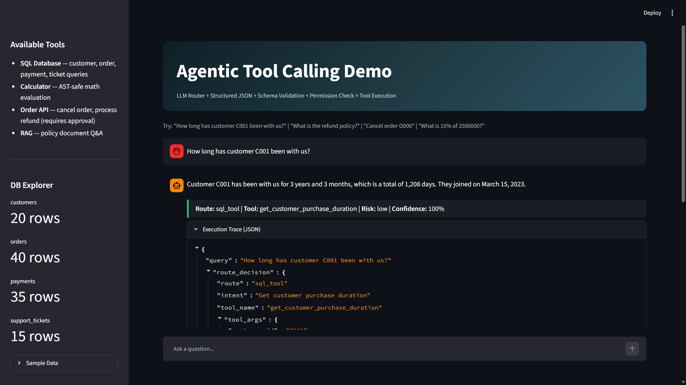
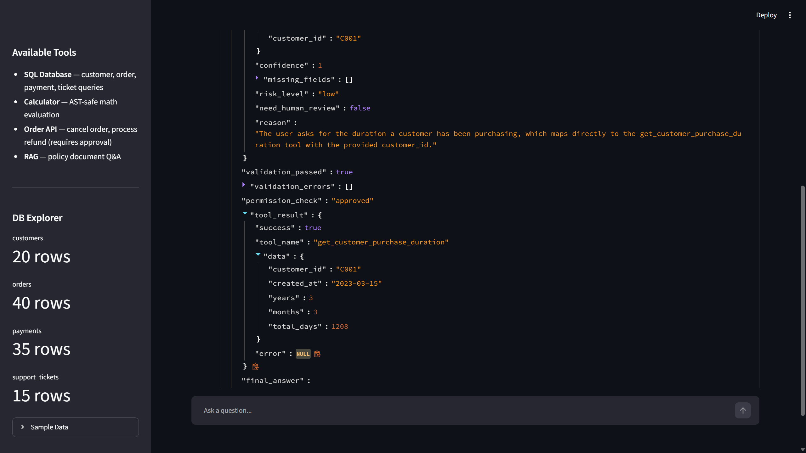
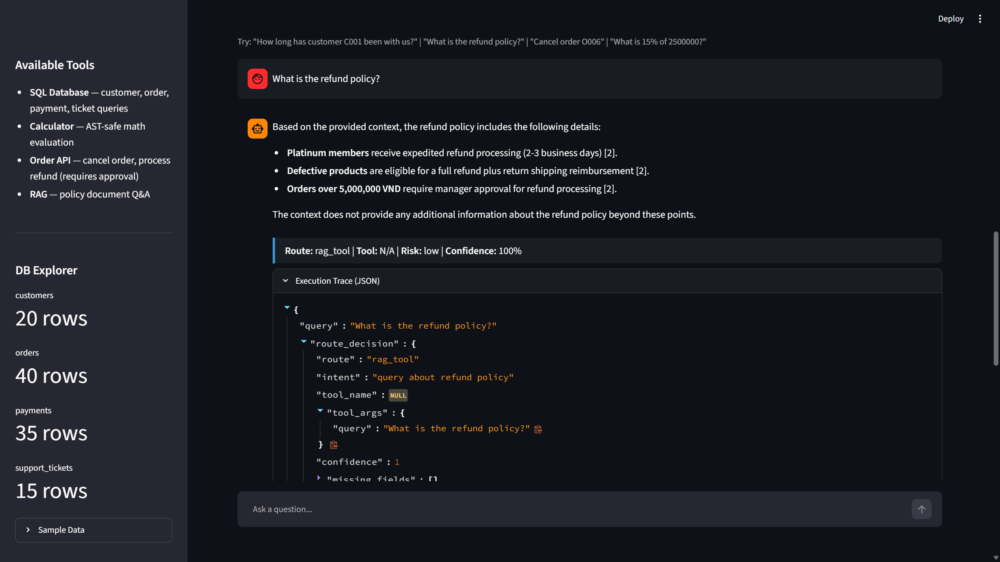
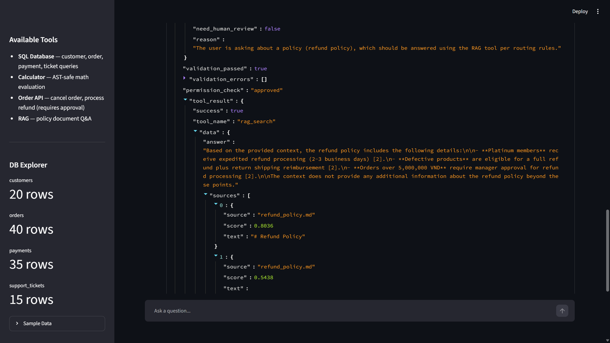
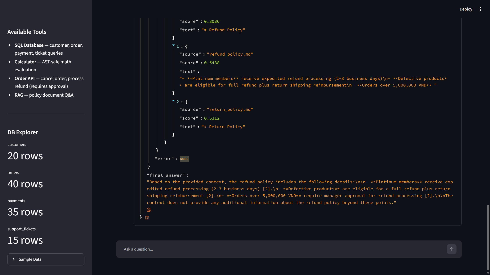

# Agentic Tool Calling Demo

An AI assistant that knows **when NOT to use RAG** — routing queries to databases, calculators, or APIs when structured data is needed instead of document retrieval.

## What This Project Proves

> **LLM never directly queries the database.** LLM creates a structured tool call, backend validates schema and permissions, then executes.

This project demonstrates:

- **Intent routing** — LLM classifies queries into 5 routes
- **Structured tool calling** — Pydantic-validated JSON decisions
- **Safe SQL execution** — Parameterized queries, no raw LLM-generated SQL
- **Permission checks** — High-risk actions require human approval
- **Clarification flow** — Missing parameters trigger follow-up questions
- **Result validation** — Schema validation before and after tool execution

## Architecture

```
User Query
  |
  v
LLM Router (DeepSeek)
  |
  v
Structured JSON Decision (Pydantic validated)
  |
  v
Schema Validation -----> FAIL --> Clarification
  |
  v (PASS)
Permission Check ------> HIGH RISK --> Human Approval Dialog
  |
  v (APPROVED)
Tool Execution
  |-- SQL Tool (parameterized queries, read-only)
  |-- Calculator (AST-safe, no eval())
  |-- Order API (cancel, refund — mock)
  |-- RAG Tool (policy docs, Qdrant in-memory)
  |
  v
LLM formats result --> Final Answer + Execution Trace
```

## 5 Routes

| Route | Trigger | Example |
|-------|---------|---------|
| **SQL Database** | Customer, order, revenue, ticket queries | "How long has C001 been a customer?" |
| **Calculator** | Math and percentage calculations | "What is 15% of 2,500,000?" |
| **RAG** | Policy and documentation questions | "What is the refund policy?" |
| **Clarification** | Missing required parameters | "Check that customer for me" (no ID) |
| **Human Approval** | Destructive actions (cancel, refund) | "Cancel order O006" |

## Demo

### SQL Route — Structured Database Query

User asks *"How long has customer C001 been with us?"* → LLM routes to `sql_tool` → parameterized query → formatted answer with full execution trace.



The execution trace shows every step: route decision, schema validation, permission check, and the actual tool result with structured data.



### RAG Route — Policy Document Search

User asks *"What is the refund policy?"* → LLM routes to `rag_tool` → Qdrant retrieval → answer with citations from policy docs.



Full trace showing validation, RAG search results with similarity scores, and source documents.





## Quick Start

```bash
git clone https://github.com/Boothill2001/agentic-tool-calling-demo.git
cd agentic-tool-calling-demo
pip install -r requirements.txt

# Configure
cp .env.example .env
# Edit .env with your DeepSeek API key

# Seed database
python seed_db.py

# Run
streamlit run app.py
```

## Sample Tool Call Decision

When a user asks *"How long has customer C001 been with us?"*, the LLM router outputs:

```json
{
  "route": "sql_tool",
  "intent": "customer_purchase_duration",
  "tool_name": "get_customer_purchase_duration",
  "tool_args": {"customer_id": "C001"},
  "confidence": 0.95,
  "missing_fields": [],
  "risk_level": "low",
  "need_human_review": false,
  "reason": "User asks about customer tenure, requires database lookup"
}
```

The backend then:
1. Validates the JSON against Pydantic schema
2. Checks `tool_name` exists in the tool registry
3. Verifies required args are present
4. Checks permission (low risk = auto-approve)
5. Executes parameterized SQL query
6. Formats result for the user

## Database

SQLite with 4 tables, ~110 rows of realistic e-commerce data:

| Table | Rows | Key Fields |
|-------|------|-----------|
| customers | 20 | customer_id, name, tier (standard/gold/platinum) |
| orders | 40 | order_id, total_amount, status |
| payments | 35 | amount, method, status |
| support_tickets | 15 | issue, priority, status |

## Tech Stack

- **LLM:** DeepSeek (OpenAI-compatible API)
- **Schema Validation:** Pydantic v2
- **Database:** SQLite (parameterized queries)
- **RAG:** Qdrant in-memory + all-MiniLM-L6-v2
- **Calculator:** AST-safe eval (no `eval()`)
- **UI:** Streamlit

## Related Projects

Part of a GenAI portfolio:

1. **[Advanced RAG](https://github.com/Boothill2001/RAG_project)** — Hybrid search + re-ranking
2. **[Research Copilot](https://github.com/Boothill2001/AI_AGENT_LANGGHAPH)** — LangGraph agent + MCP
3. **[Enterprise RAG Assistant](https://github.com/Boothill2001/Enterprise_RAG_Assistant)** — RBAC, tool calling, eval harness
4. **[Chunking Strategies](https://github.com/Boothill2001/rag-chunking-strategies)** — Chunking impact on retrieval
5. **Agentic Tool Calling** (this repo) — Structured tool calling + human approval

## Author

**Nguyen Minh Tri** — Senior AI Engineer

- Email: minhtri.cm2001@gmail.com
- [GitHub](https://github.com/Boothill2001)
